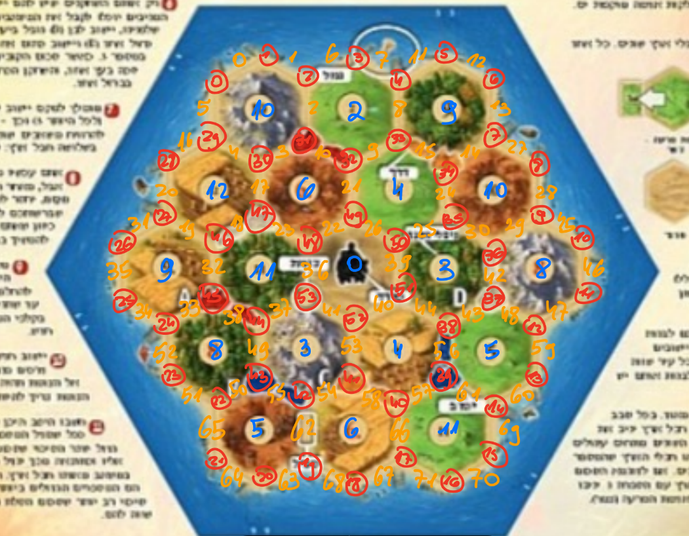

# Catan Game - C++ Code Files #

Welcome to the Catan Game project. This project contains a basic implementation of the Catan game in the C++ programming language. The project includes the creation of vertices, edges, tiles, and the game board, as well as basic game logic.

## Game map ##
The game map is based on the picture in the project.
Each vertex, edge, tile number and resource are also fixed according to the image.

## Files ##

### vertex.hpp and vertex.cpp ###

These files define and implement the `vertex` class, which represents a vertex in the Catan game.
Where settlements and cities are placed.

**Attributes**:
  - `numberId`: A unique identifier for the vertex.
  - `isClear`: A boolean indicating whether the vertex is clear (unoccupied).

**Methods**:
  - `getNumberId()`: Returns the vertex's unique identifier.
  - `getIsClear()`: Returns whether the vertex is clear.
  - `setIsClear(bool isClear)`: Sets the vertex's clear status.
  - `printVertex()`: Prints the details of the vertex.

### edge.hpp and edge.cpp ###

These files define and implement the `edge` class, which represents an edge in the Catan game.
Where roads are placed.

**Attributes**:
  - `a`, `b`: Pointers to the vertices that the edge connects.
  - `isClear`: A boolean indicating whether the edge is clear (unoccupied).

**Methods**:
  - `getVertexA()`, `getVertexB()`: Return pointers to the vertices that the edge connects.
  - `getNameOfEdge()`: Returns a string representation of the edge's name.
  - `getIsClear()`: Returns whether the edge is clear.
  - `setIsClear(bool isClear)`: Sets the edge's clear status.
  - `printEdge()`: Prints the details of the edge.

### tile.hpp and tile.cpp ###

These files define and implement the `tile` class, which represents a tile in the Catan game. (specific resource).

**Attributes**:
  - `typeOfResource`: The type of resource that the tile produces.
  - `number`: The number associated with the tile.
            A number that, if the dice are the same as him, the player sitting on the same resource, will receive the resource
  - `hasRobbed`: A boolean indicating whether the tile has been robbed.
  - `vertexes`: A vector of pointers to the vertices associated with the tile.
  - `edges`: A vector of pointers to the edges associated with the tile.

**Methods**:
  - `getTypeOfResource()`, `getNumber()`, `getHasRobbed()`: Return the tile's resource type, number, and robbed status, respectively.
  - `getVertexes()`, `getEdges()`: Return the vectors of vertices and edges associated with the tile.
  - `setHasRobbed(bool hasRobbed)`: Sets the tile's robbed status.
  - `printTile()`: Prints the details of the tile.

### board.hpp and board.cpp ###

These files define and implement the `board` class, which represents the game board in the Catan game. (The whole board, meaning all the tiles)

**Attributes**:
  - `tiles`: A vector of `tile` objects representing the game board's tiles.

**Methods**:
  - `get_board()`: Returns the vector of tiles.
  - `printBoard()`: Prints the details of the board.
  - `initialBoard()`: Initializes and returns the initial state of the board.

### player.hpp and player.cpp ###

These files define and implement the `player` class, representing players in the Catan game.

**Attributes**:
  - `nameOfPlayer`: The name of the player.
  - `age`: The age of the player.
  - `numberOfPoints`: The points accumulated by the player.
  - `roads`, `settlements`, `citys`: Vectors representing the player's roads, settlements, and cities.
  - `resources`: A vector representing the player's resources (WOOD, IRON, WHEAT, SHEEP, CLAY).
  - `myTurn`: A boolean indicating if it's the player's turn.
  - `hasRollDice`: A boolean indicating if the player has rolled the dice.
  - `numberOfKnightCards`: The number of knight cards held by the player.
  - `developmentCards`: A map of development card names and quantities held by the player.

**Methods**:
  - Various methods to access and manipulate player attributes including points, resources, actions, settlements, cities, roads, development cards, and game actions such as rolling dice, placing settlements and cities, placing roads, buying development cards, playing development cards, trading resources, and ending turns.

### person.hpp ###

This file defines the `person` class, representing individuals in the game.

**Attributes**:
  - `nameOfPlayer`: The name of the person.
  - `age`: The age of the person.
These features are inherited by the player.

**Methods**:
  - Various methods to access person attributes.

### gameLogic.hpp ###

This file defines the `gameLogic` class, managing game rules and turns in the Catan game.

**Attributes**:
  - `players`: A vector of `player` objects representing the players in the game.
  - `numberTurn`: The current turn number.

**Methods**:
  - Methods to access and manipulate game turns and player interactions including choosing the first player, advancing to the next turn, adding resources, and checking game completion conditions.

### developmentCard.hpp, knightCard.hpp, monopolyCard.hpp, roadBuildingCard.hpp, victoryPointCard.hpp, yearOfPlentyCard.hpp ###

These files define various development card classes used in the Catan game, extending from the `developmentCard` base class. Each class provides methods to get the card type and play the card with specific effects.

The form of implementation of the development cards was to make a file of `developmentCard` that contains pure virtual functions (which will create an interface).
Each development card inherits this class, overrides the functions and implements them properly in its own class.

## Usage ##

`main.cpp` - During the run of the main we can see two rounds of choosing settlements and roads for each player. Then there is one turn from all player. one of them  tries to trade with another player, buying a development card and using it.
